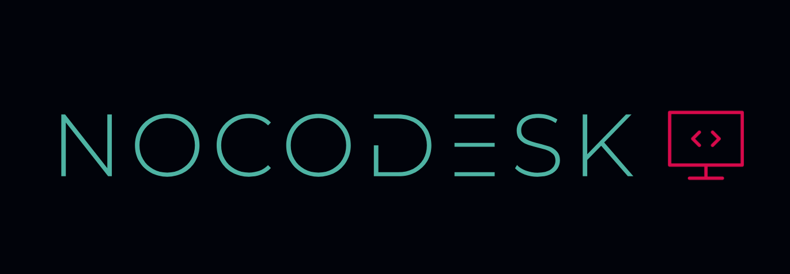

# NOCODESK - Bridging the Gap in Machine Learning 🚀

## Introduction 🧠
NOCODESK is an innovative machine learning platform aimed at closing the chasm between theoretical knowledge and practical implementation of machine learning. Whether you're a student, an enthusiast, or a professional, NOCODESK empowers you to explore the world of AI and ML with ease.

## Features ✅
- Streamlined Learning: NOCODESK provides a user-friendly interface for data preprocessing, model selection, training, and evaluation. 📊
- Seamless Interactivity: With a few clicks, you can upload datasets, preprocess data, choose from various ML models, and observe the results. 📖
- Educational Tool: It's not just a tool; it's a learning experience. NOCODESK helps users relate AI and ML theory to real-world applications effectively. ⏱️
- Full-Stack Ready: NOCODESK is a proof of concept (POC), and our future plans include deploying it as a full-stack web application. 📈

## Technologies Used 🛠️
- Python: The heart of our platform for data processing, model development, and analysis. 🐍
- Streamlit: Our web app's backbone, allowing seamless interaction and visualization of machine learning tasks. 💻
- Data Visualization Libraries (e.g., Matplotlib, Seaborn): For creating informative data visualizations. 📊
- Data Preprocessing Tools (e.g., Pandas, scikit-learn): For data cleaning, transformation, and feature engineering. 🧹
- Machine Learning Libraries (e.g., Scikit-learn, Keras): Enabling model selection, training, and evaluation. 🤖

## Uses 🌟
- Learning Experience: NOCODESK is designed for those who want to learn and apply AI and ML concepts practically. 📚
- Classroom Aid: Teachers and educators can use it to demonstrate machine learning concepts to students. 🏫
- Skill Enhancement: Professionals and enthusiasts can use it to brush up their machine learning skills. 💼
- Research and Experimentation: Researchers can utilize NOCODESK for data analysis and quick experimentation. 🧪

## Demo Video 📽️

<!-- [[If the above link dont work Click here!]](https://youtu.be/aY4pZ4EAAek) -->

## How to Use NOCODESK 📝
1. Navigate to our website (currently under development).
2. Create an account or log in as a guest.
3. Explore the user-friendly interface.
4. Upload datasets and apply data preprocessing.
5. Choose machine learning models and perform training.
6. Evaluate your models and visualize results.
7. Learn, experiment, and enjoy the power of machine learning.

## Get in Touch 📬
Have questions, feedback, or collaboration ideas? Feel free to reach out to us. Your input is invaluable to us.

## Future Roadmap 🚀
The future of NOCODESK involves:

- Completing the POC and deploying the full-stack web version.
- Expanding the platform to include more machine learning models, data sources, and features.
- Collaborating with educational institutions, professionals, and AI/ML enthusiasts.

Stay tuned for more exciting developments on NOCODESK!

